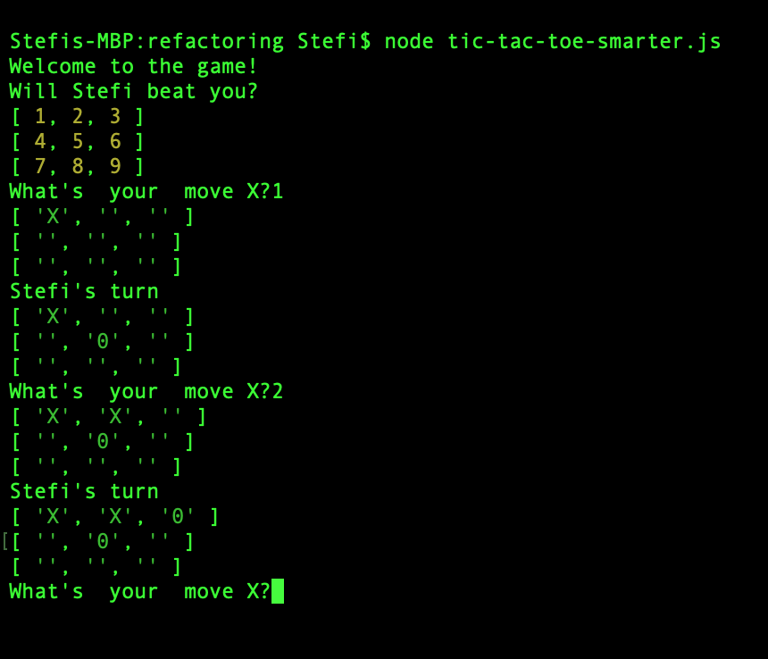

# Tic Tac Toe Game

Build a Tic Tac Toe game with NodeJS that can be played in the terminal. You can play against another human or against the computer



### Human vs Human

Tic Tac Toe game for two humans that will be played in the terminal! You can play it with a friend or against yourself 😂

Code at: [tic-tac-toe-2players.js](/src/tic-tac-toe-2players.js)

### Human vs Computer

Play against the computer. The computer is not very smart, the computer will randomly pick a free spot and enter there the zero.

Code at [tic-tac-toe-computerRandom.js](/src/tic-tac-toe-computerRandom.js)

### Human vs Computer

Play against the a slightly smarter computer.

Code at [tic-tac-toe-computerRandom.js](/src/tic-tac-toe-smarter.js)

## Install and Test

```
$ git clone https://github.com/stefi23/tic-tac-toe.git
$ cd tic-tac-toe
// To play human vs human
$ node tic-tac-toe-2players.js
// To play human vs computer vs. random
$ node tic-tac-toe-computerRandom.js
// To play human vs computer vs. a slightly smarter computer
$ node tic-tac-toe-smarter.js
```
